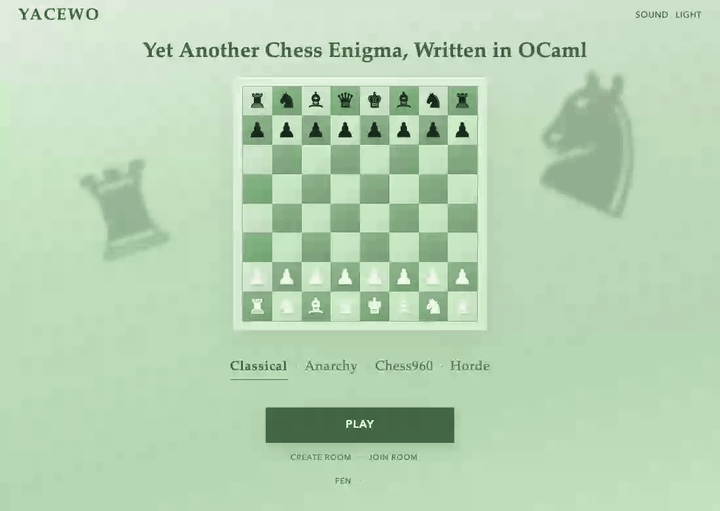
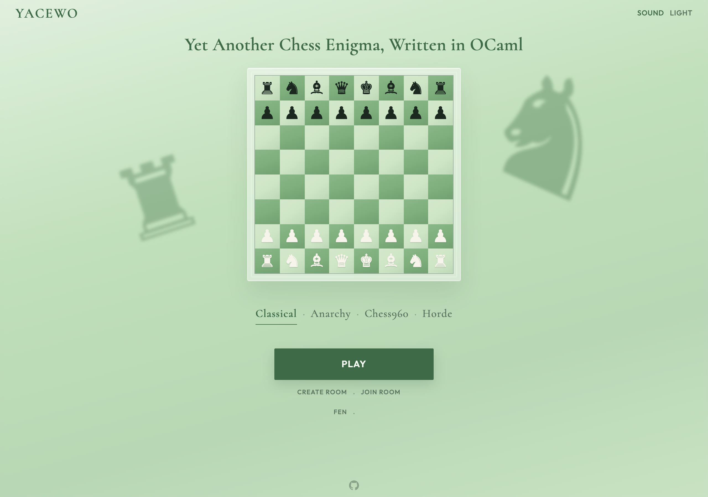
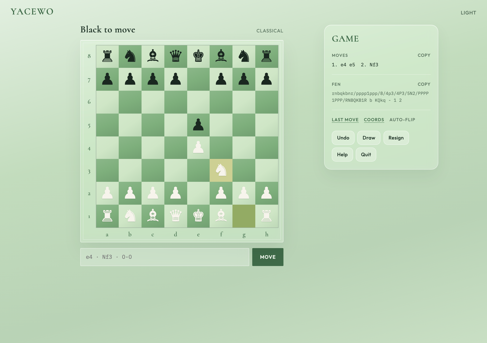
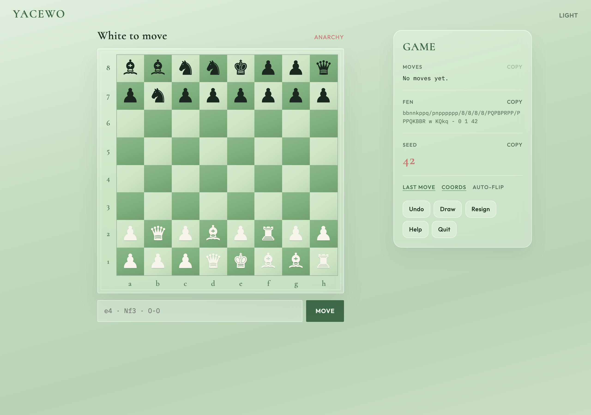
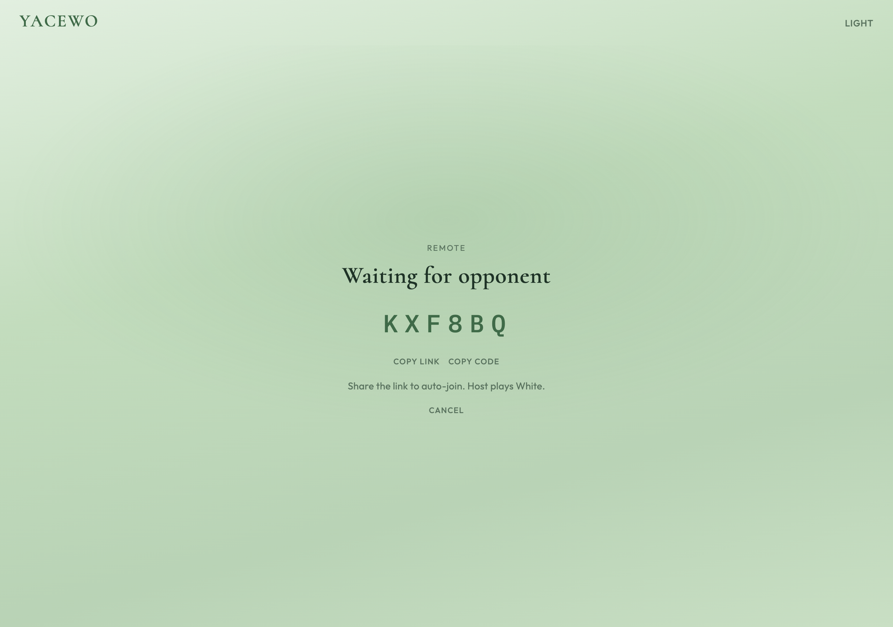
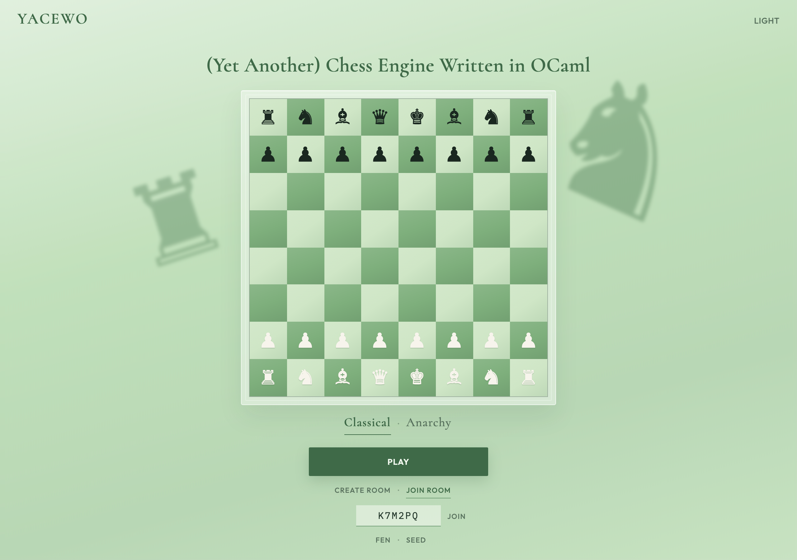

# YACEWO

**(Yet Another) Chess Engine Written in OCaml**

[Play online →](https://cro64.github.io/yacewo/)

Two-player chess in the browser or terminal — **Classical** openings, **Anarchy**
seeded armies, **Chess960**, and **peer-to-peer rooms** you can share with a link.

<p align="center">
  
</p>

## Features

- **Classical** — standard chess with castling, promotion, en passant, checkmate, and draws
- **Anarchy** — seeded random armies (kings fixed); same seed → same position; shareable `?seed=…` links
- **Chess960** — FIDE / Scharnagl IDs **0–959** (SP-518 = classical); share as `?mode=chess960&seed=…`
- **Remote play** — Create Room, share a link or code; guest auto-joins; host is White; guests rejoin after a drop
- **Board prefs** — Last move highlights, Coords, and hotseat Auto-flip (all off by default); kings tint when in check
- **Hotseat** — local two-player on one device; Auto-flip keeps the side to move at the bottom
- **FEN & Seed** — load positions (optional 7th-field Anarchy seed or Chess960 ID); one-click copy for FEN, moves, or seed/ID
- **Notation** — click-to-move or type `e4`, `Nf3`, `O-O`, …; Escape clears selection / Help
- **Undo / Resign / Draw / Quit** — offer-and-accept draws; Undo is hotseat only (disabled online)

## Screenshots

### Landing

Classical, Anarchy, or Chess960, then Play — or create / join a remote room. FEN
and Seed open when you need a custom start. Anarchy seeds sync as `?seed=…`;
Chess960 FIDE IDs as `?mode=chess960&seed=…` (0–959).

<p>
  
</p>

### Classical

Standard rules, move list, live FEN with copy, optional Last move / Coords /
Auto-flip, and the usual game actions (Quit returns to the landing screen).

<p>
  
</p>

### Anarchy

Pick or roll a seed; the army layout is reproducible and shown in the panel
(and in FEN as a seventh field). Open `/yacewo/?seed=42` to land on that army.

<p>
  
</p>

### Chess960

Uses the FIDE / Scharnagl numbering (**0–959**). SP-518 is the classical
starting array. Castling follows Chess960 (king ends on c/g, rook on d/f).
Open `/yacewo/?mode=chess960&seed=518` for the familiar layout.

### Remote rooms

**Create Room** opens a lobby with a code and a shareable link
(`?room=…`). Guests can paste a code on the landing page or open the link to
auto-join. Setup (Classical, Anarchy seed, Chess960 ID, or FEN) is sent with the handshake.
If a guest disconnects mid-game, the host waits and the guest can rejoin the
same room.

<p>
  
  &nbsp;
  
</p>

## Web UI

Live site: **https://cro64.github.io/yacewo/**

```sh
make web          # js_of_ocaml bridge + static site → docs/
make web-dev      # local Vite at /yacewo/
```

Requires Node.js and `opam install js_of_ocaml js_of_ocaml-ppx`.

Regenerate README screenshots / demo (with `make web-dev` or `vite preview` running):

```sh
# optional: YACEWO_URL=https://cro64.github.io/yacewo/
node scripts/capture-demos.mjs   # needs playwright + ffmpeg
```

## Terminal

```sh
make build
make test
make play
```

See [INSTALL.md](INSTALL.md) for OCaml and web setup.
