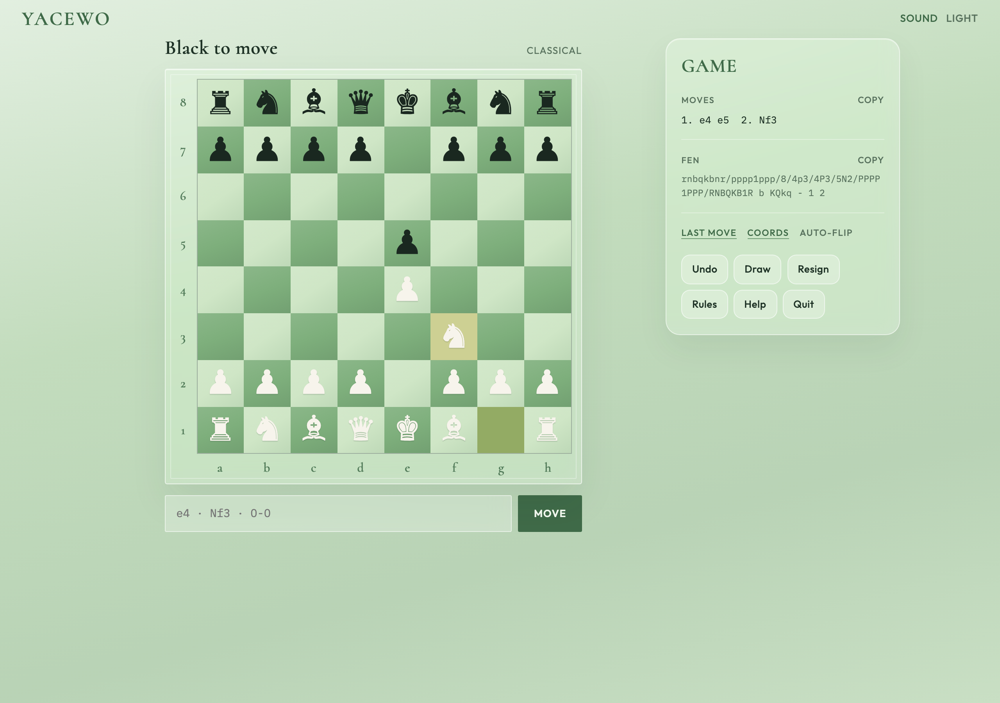
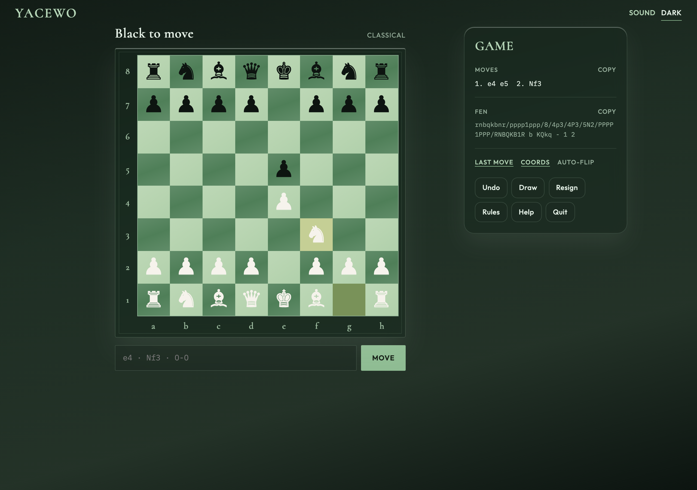
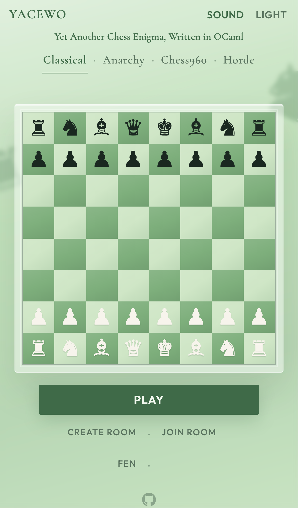
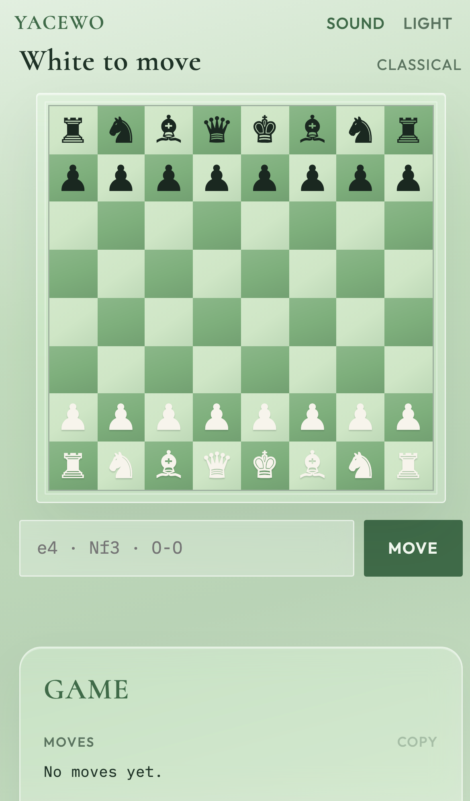
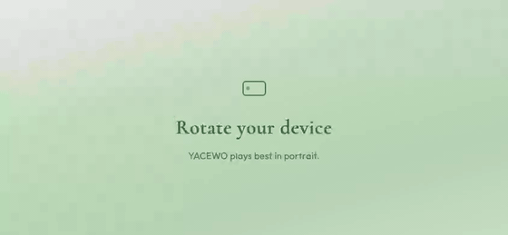
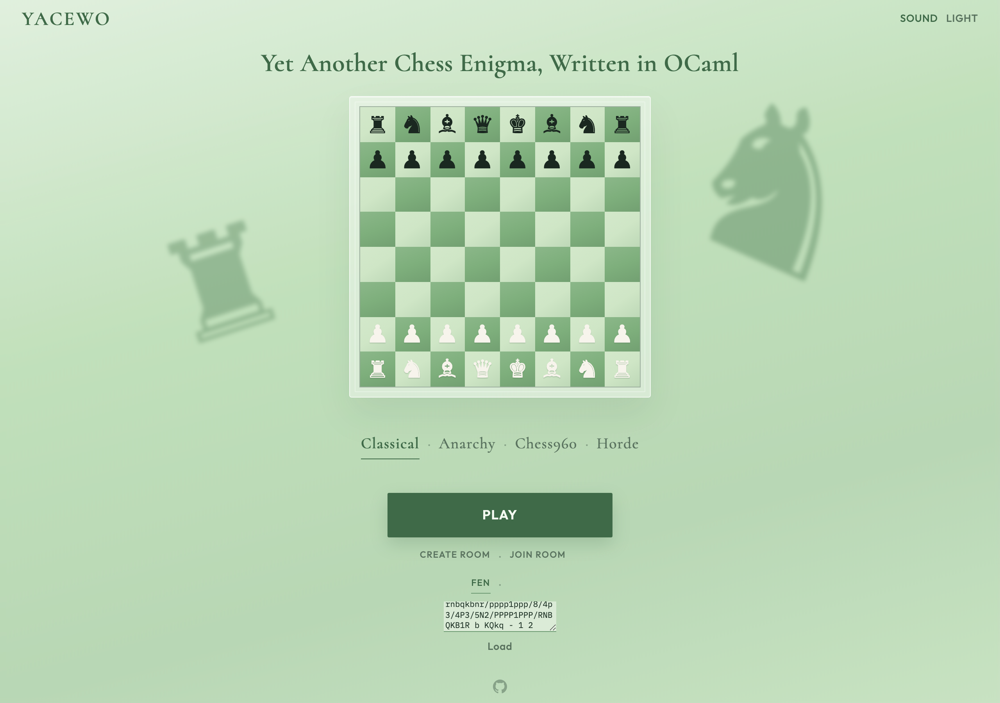
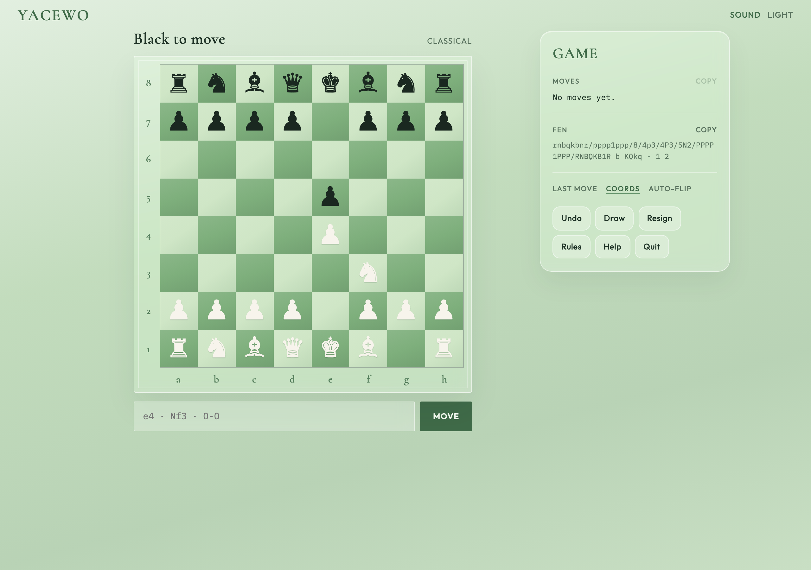
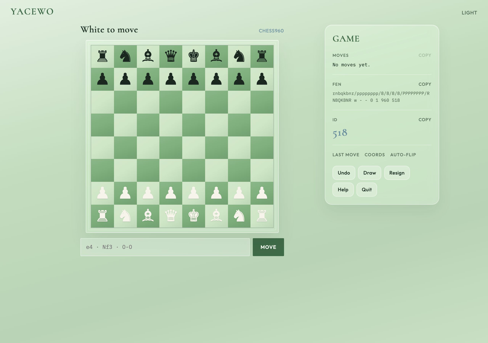
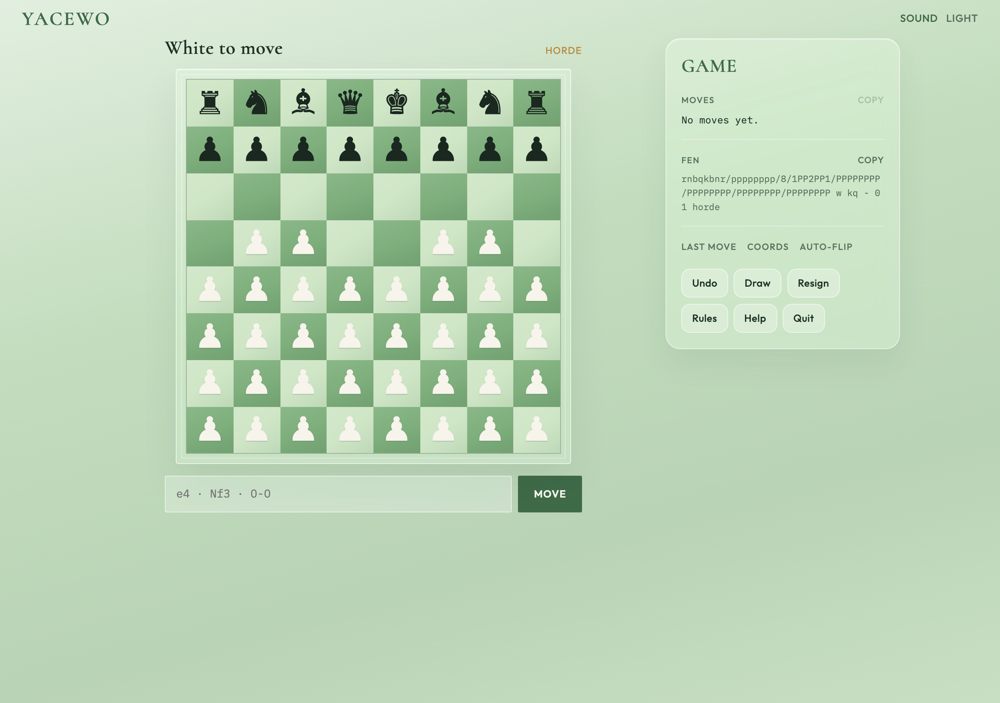
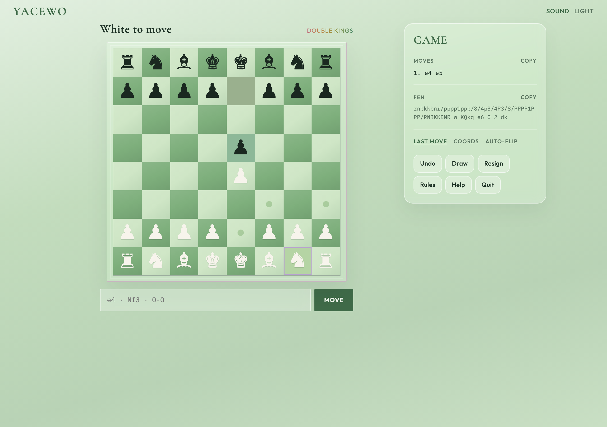

# YACEWO

**Yet Another Chess Enigma, Written in OCaml**

[Play online →](https://cro64.github.io/yacewo/)

Two-player chess in the browser or the terminal. Classical, Anarchy,
Chess960, Horde. Share a room, or paste a FEN and pick up where you left off.

## Tour

### Landing preview + Classical play

<p align="center">
  
</p>

### Light & dark

<p align="center">
  
  &nbsp;
  
</p>

### Made for phones

<p align="center">
  
  &nbsp;
  
  &nbsp;
  
</p>

### Pick up any position

<p align="center">
  
  &nbsp;
  
</p>

### Play someone remotely

<p align="center">
  
</p>

## What you get

- Hotseat on one phone, or a room you can share
- Classical, Anarchy, Chess960, Horde
- One-tap copy for FEN, moves, seed/ID
- Last-move glow, coords, auto-flip. All optional.
- Click pieces or type `e4`, `Nf3`, `O-O`
- Light / dark, sound on / off, portrait-first on phones

## Ways to play

### Classical

The normal game. Castling, en passant, promotion, mates and draws. Live move
list. FEN you can copy whenever.

<p>
  
</p>

### Anarchy

Random armies. Kings stay put. Pick a seed (or roll one). Same seed =
same chaos, so you can text it to a friend and open the identical mess.

<p>
  
</p>

### Chess960

Fischer Random with the usual FIDE IDs (0 to 959). Pick a number, share it.
Castling still works the Chess960 way.

<p>
  
</p>

### Horde

Thirty-six White pawns. One normal Black army. Survive the wave, or eat every
last pawn.

<p>
  
</p>

### Remote rooms

One person creates. The other joins. Host is White, guest is Black. Play in
any game mode.

You can still move if they step away. Reconnect anytime in 24 hours.

<p>
  
  &nbsp;
  
</p>

<p>
  
</p>

## Easter egg

### Queer

<p>
  
</p>

## Run it yourself

Live site: **[https://cro64.github.io/yacewo/](https://cro64.github.io/yacewo/)**

```sh
make web          # release js_of_ocaml bridge + static site → docs/ (local preview)
make web-dev      # local Vite at http://localhost:5173/yacewo/
```

Requires Node.js and `opam install js_of_ocaml js_of_ocaml-ppx`.

Production `make web` / CI builds the bridge with `dune --profile release` (whole-program
js_of_ocaml). That shrinks `yacewo_engine.js` from ~2.6MB (dev/separate) to ~114KB.
Do not commit `docs/` — GitHub Actions builds and deploys Pages on push to `main`.

### Remote rooms (deploy)

Finished games die after 15 minutes. Idle unfinished rooms after 24 hours.

1. **Deploy the Worker** (once per Cloudflare account). See
   [yacewo-worker/README.md](yacewo-worker/README.md):

   ```sh
   cd yacewo-worker
   npm install
   npx wrangler login
   npm run deploy
   ```

   Free-plan Durable Objects need `new_sqlite_classes` in `wrangler.toml`
   (already set). Copy the printed URL, e.g.
   `https://yacewo-rooms.<subdomain>.workers.dev`.

2. **Point the UI at it** before building (Vite bakes values in at build time):

   ```sh
   # web/ui/.env.local (gitignored)
   VITE_YACEWO_ROOMS_URL=https://yacewo-rooms.<subdomain>.workers.dev
   VITE_VAPID_PUBLIC_KEY=<from npx @pushforge/builder vapid>
   ```

   Set the matching private key on the Worker (`wrangler secret put
   VAPID_PRIVATE_KEY`). Details in [yacewo-worker/README.md](yacewo-worker/README.md).

3. **Build / run**

   ```sh
   make web-dev   # local UI → live Worker; test join in an incognito window
   make web       # local production build into docs/ (gitignored)
   ```

   Pushing to `main` runs `.github/workflows/pages.yml`, which rebuilds the site
   and deploys it. Repo **Settings → Pages → Source** must be **GitHub Actions**
   (not the `/docs` folder on a branch). Optionally set repository variables
   `VITE_YACEWO_ROOMS_URL` and `VITE_VAPID_PUBLIC_KEY` if they change.

   Two players need separate browser profiles (or incognito). Same profile
   reuses the room identity token and can't open two seats.

Regenerate README screenshots / demos (with `make web-dev` running):

```sh
YACEWO_URL=http://localhost:5173/yacewo/ node scripts/capture-demos.mjs
# needs playwright + ffmpeg
```

## Terminal

```sh
make build
make test
make play
```

See [INSTALL.md](INSTALL.md) for OCaml and web setup.

## Credits

Main engine started as a CS3110 @ Cornell final project. Heavily modified
since.

Queer mode inspired by [homonormative-chess](https://github.com/SwiftWinds/homonormative-chess) 💅
